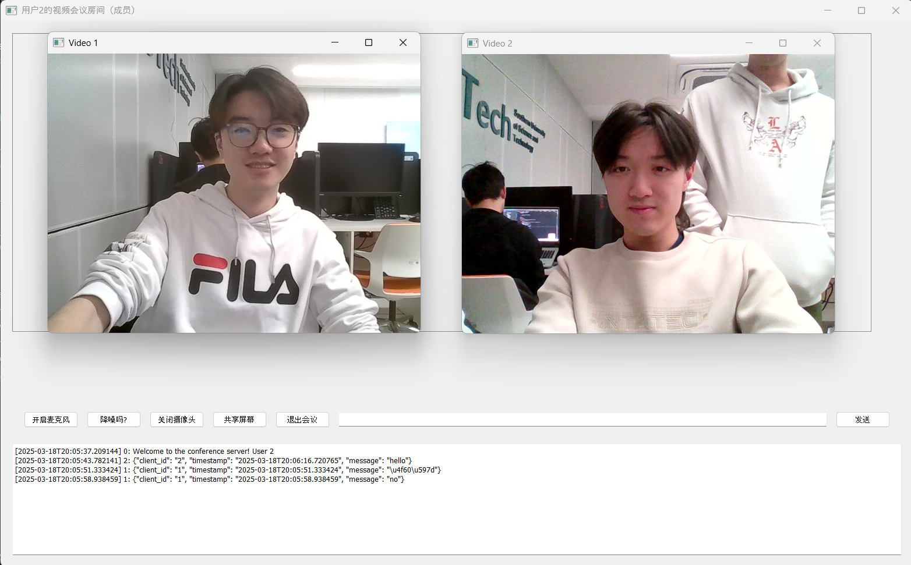

# CS305 Computer Networks Project: Remote Meeting

## Project Description

This project implements a **Remote Meeting System** that allows users to conduct real-time video conferences over a network. The system supports **video**, **audio**, and **text communication** among multiple participants. It is built using a **Client-Server (CS)** architecture, where the server manages multiple conference rooms and facilitates communication between clients. The system is designed to handle multiple meetings simultaneously, ensuring that each meeting operates independently and securely.

## Key Features

**1. Client-Server Architecture**

- Server: Manages multiple conference rooms, tracks client actions (e.g., joining, leaving, creating, and canceling meetings), and forwards data between participants.

- Client: Allows users to create, join, and exit meetings. Clients can send and receive video, audio, and text messages in real time.

**2. Real-Time Communication**

- Text Chat: Users can send text messages to the server, which broadcasts them to all participants in the meeting. Each message includes the sender's ID and a timestamp.

- Video Streaming: Users can turn their cameras on or off. The server forwards video streams to all participants, and clients display real-time video from multiple users using a split-screen view.

- Audio Streaming: Users can turn their microphones on or off. The server mixes audio streams from multiple users and distributes the combined stream to all participants.

**3. Meeting Management**

- Create Meetings: A client can request the server to create a new meeting. Once created, other users can join the meeting.

- Join Meetings: Clients can view a list of available meetings and join any of them.

- Exit Meetings: Clients can leave a meeting at any time without affecting other participants.

- Cancel Meetings: The creator of a meeting can cancel it, which removes all participants and prevents new users from joining.

**4. Multiple Meetings and Participants**

- Multiple Participants: The system supports multiple clients (at least 3) in a single meeting, ensuring smooth communication through audio, video, and text.

- Parallel Meetings: The server can handle multiple meetings simultaneously. Each meeting operates independently, with no interference between meetings.

## Steps to run the project:

**1. Clone the repository**:

```bash
git clone https://github.com/bpqw/CS305-Project.git
```

**2. Install the required libraries:**
Use pip or conda to install the dependencies:

```bash
pip install -r requirements.txt
```

**3. Run the server:**
Open a terminal and start the server:

```bash
python conf_server.py
```

- The server port can be configured manually by changing the SERVER_PORT value in config.py.

**4. Run the application:**
Open another terminal and start the application:

```bash
python ui.py
```

**5. You're good to go!**
Now, try creating a meeting room and test out the camera, mic, chat, and other features with your friends.

Below are some screenshots of the project in action:



## Members and Contributions

| Name          | Contribution                       |
| ------------- | ---------------------------------- |
| Tan Hao Yang  | Text, Audio and Video Transmission |
| Jianhao Zhang | Text, Audio and Video Transmission |
| Yifan Liu     | User Interface                     |
| Mingyu Zhu    | Meeting Rooms Operations           |
